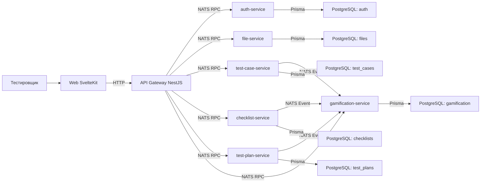

# TMS - Test Management System

Демонстрационный fullstack-проект для создания сервиса для хранения тестовой документации.

## Стек

- **Backend:** NestJS, TypeScript, NATS (брокер сообщений), PostgreSQL, Prisma
- **Frontend:** SvelteKit, TypeScript
- **Инфраструктура:** Docker, Docker Compose, pnpm workspaces

## Архитектура

## Структура репозитория

tms/ - apps/ # запускаемые приложения (микросервисы, gateway, web) - packages/ # переиспользуемые библиотеки (DTO, контракты сообщений) - tsconfig.base.json - exling.config.mjs - .prettierrc.json - .editorconfig - pnpm-workspace.yaml - package.json

См. также:

- [`apps/README.md`](./apps/README.md) - что находится в `apps/`
- [`packages/README.md`](./packages/README.md) - что находится в `packages/`

## Требования к окружению

- Node.js >= 20
- pnpm >= 10
- Git
- Docker

## Команды

Все команды запускаются из корня репозитория

- `pnpm install` - установить зависимости всех пакетов workspace
- `pnpm lint` - проверить весь код линтером (ESLint)
- `pnpm lint:fix` - Линтер с автоисправлением
- `pnpm format` - переформатировать весь код (Prettier)
- `pnpm format:check` - только проверить форматирование для (CI)
- `pnpm typecheck` - проверка типов TypeScript без компиляции

## Лицензия

Пока лицензии нет.
